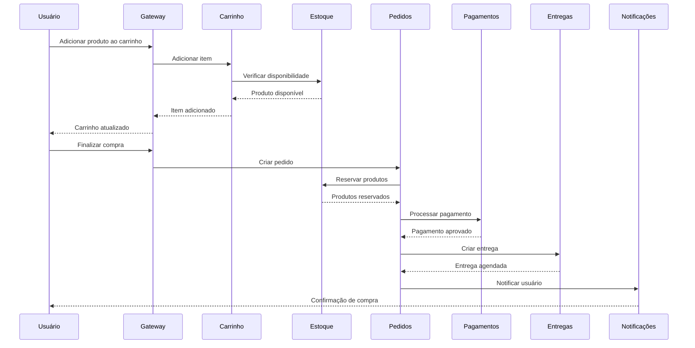

# 🛒 Arquitetura E-commerce Compraê

## 📋 Visão Geral

O **Compraê** é uma plataforma de e-commerce baseada em microserviços, projetada para alta escalabilidade, disponibilidade e manutenibilidade. Cada serviço é responsável por um domínio específico do negócio e se comunica com outros serviços através de APIs REST e eventos assíncronos via Apache Kafka.

## 🏗️ Microserviços do E-commerce

### 1. 👥 Serviço de Usuários (`comprae-usuario-service`)
**Porta:** 8081  
**Banco:** `comprae_usuarios`

**Responsabilidades:**
- Cadastro e autenticação de usuários
- Gerenciamento de perfis
- Controle de permissões e roles
- Endereços de entrega
- Histórico de atividades

**Endpoints Principais:**
- `POST /usuarios` - Cadastrar usuário
- `GET /usuarios/{id}` - Buscar usuário
- `PUT /usuarios/{id}` - Atualizar perfil
- `POST /auth/login` - Autenticação

### 2. 📦 Serviço de Produtos (`comprae-produto-service`)
**Porta:** 8082  
**Banco:** `comprae_produtos`

**Responsabilidades:**
- Catálogo de produtos
- Especificações técnicas
- Imagens e mídias
- Preços e promoções
- Busca e filtros (Elasticsearch)

**Endpoints Principais:**
- `GET /produtos` - Listar produtos
- `GET /produtos/{id}` - Detalhes do produto
- `POST /produtos/busca` - Busca avançada
- `GET /produtos/categoria/{id}` - Produtos por categoria

### 3. 🏷️ Serviço de Categorias (`comprae-categoria-service`)
**Porta:** 8083  
**Banco:** `comprae_categorias`

**Responsabilidades:**
- Hierarquia de categorias
- Atributos específicos por categoria
- Navegação facetada
- SEO por categoria

**Endpoints Principais:**
- `GET /categorias` - Árvore de categorias
- `GET /categorias/{id}` - Detalhes da categoria
- `GET /categorias/{id}/atributos` - Atributos da categoria

### 4. 📊 Serviço de Estoque (`comprae-estoque-service`)
**Porta:** 8084  
**Banco:** `comprae_estoque`

**Responsabilidades:**
- Controle de quantidade em estoque
- Reserva temporária de produtos
- Alertas de estoque baixo
- Histórico de movimentações
- Integração com fornecedores

**Endpoints Principais:**
- `GET /estoque/{produtoId}` - Consultar estoque
- `POST /estoque/reserva` - Reservar produtos
- `PUT /estoque/baixa` - Dar baixa no estoque
- `GET /estoque/alertas` - Produtos com estoque baixo

### 5. 🛒 Serviço de Carrinho (`comprae-carrinho-service`)
**Porta:** 8085  
**Armazenamento:** Redis (sessão temporária)

**Responsabilidades:**
- Gerenciamento do carrinho de compras
- Cálculo de totais
- Aplicação de cupons de desconto
- Carrinho abandonado
- Sincronização entre dispositivos

**Endpoints Principais:**
- `POST /carrinho/itens` - Adicionar item
- `GET /carrinho/{usuarioId}` - Carrinho do usuário
- `PUT /carrinho/itens/{id}` - Atualizar quantidade
- `DELETE /carrinho/itens/{id}` - Remover item

### 6. 📋 Serviço de Pedidos (`comprae-pedido-service`)
**Porta:** 8086  
**Banco:** `comprae_pedidos`

**Responsabilidades:**
- Processamento de pedidos
- Estados do pedido (pendente, confirmado, cancelado)
- Histórico de pedidos
- Integração com pagamentos e entrega
- Relatórios de vendas

**Endpoints Principais:**
- `POST /pedidos` - Criar pedido
- `GET /pedidos/{id}` - Detalhes do pedido
- `GET /usuarios/{id}/pedidos` - Histórico do usuário
- `PUT /pedidos/{id}/status` - Atualizar status

### 7. 💳 Serviço de Pagamentos (`comprae-pagamento-service`)
**Porta:** 8087  
**Banco:** `comprae_pagamentos`

**Responsabilidades:**
- Processamento de pagamentos
- Integração com gateways (PagSeguro, Mercado Pago, etc.)
- Gestão de cartões salvos
- Estornos e reembolsos
- Análise de fraude

**Endpoints Principais:**
- `POST /pagamentos` - Processar pagamento
- `GET /pagamentos/{id}` - Status do pagamento
- `POST /pagamentos/{id}/estorno` - Estornar pagamento
- `GET /pagamentos/metodos` - Métodos disponíveis

### 8. 🚚 Serviço de Entregas (`comprae-entrega-service`)
**Porta:** 8088  
**Banco:** `comprae_entregas`

**Responsabilidades:**
- Cálculo de frete
- Integração com transportadoras (Correios, Total Express, etc.)
- Rastreamento de encomendas
- Pontos de retirada
- SLA de entrega

**Endpoints Principais:**
- `POST /entregas/calcular` - Calcular frete
- `POST /entregas` - Criar entrega
- `GET /entregas/{id}/rastreamento` - Rastrear encomenda
- `GET /entregas/pontos-retirada` - Pontos de retirada

### 9. 🔔 Serviço de Notificações (`comprae-notificacao-service`)
**Porta:** 8089  
**Armazenamento:** Redis (filas) + Kafka (eventos)

**Responsabilidades:**
- Notificações push, email e SMS
- Templates de notificação
- Preferências do usuário
- Campanhas de marketing
- Notificações em tempo real

**Endpoints Principais:**
- `POST /notificacoes` - Enviar notificação
- `GET /usuarios/{id}/notificacoes` - Notificações do usuário
- `PUT /notificacoes/{id}/lida` - Marcar como lida
- `GET /notificacoes/templates` - Templates disponíveis

### 10. ⭐ Serviço de Avaliações (`comprae-avaliacao-service`)
**Porta:** 8091  
**Banco:** `comprae_avaliacoes`

**Responsabilidades:**
- Avaliações e comentários de produtos
- Sistema de notas (1-5 estrelas)
- Moderação de conteúdo
- Ranking de produtos
- Avaliações verificadas

**Endpoints Principais:**
- `POST /avaliacoes` - Criar avaliação
- `GET /produtos/{id}/avaliacoes` - Avaliações do produto
- `GET /avaliacoes/{id}` - Detalhes da avaliação
- `PUT /avaliacoes/{id}/moderacao` - Moderar avaliação

## 🔄 Fluxos de Negócio

### Fluxo de Compra Completo

### Eventos Kafka

| Tópico | Produtor | Consumidores | Descrição |
|--------|----------|--------------|-----------|
| `usuario.criado` | Usuario Service | Notificação | Novo usuário cadastrado |
| `produto.estoque.baixo` | Estoque Service | Notificação | Estoque baixo |
| `pedido.criado` | Pedidos Service | Pagamentos, Entregas, Notificação | Novo pedido |
| `pagamento.aprovado` | Pagamentos Service | Pedidos, Notificação | Pagamento confirmado |
| `entrega.enviada` | Entregas Service | Pedidos, Notificação | Produto enviado |
| `avaliacao.criada` | Avaliações Service | Produtos, Notificação | Nova avaliação |

## 🛡️ Padrões de Segurança

### Autenticação e Autorização
- **JWT Tokens** para autenticação stateless
- **OAuth 2.0** para integrações externas
- **RBAC** (Role-Based Access Control)
- **Rate Limiting** por usuário/IP

### Comunicação Segura
- **HTTPS** obrigatório em produção
- **mTLS** entre microserviços críticos
- **API Keys** para serviços internos
- **Criptografia** de dados sensíveis

## 📊 Monitoramento e Observabilidade

### Métricas de Negócio
- **Taxa de conversão** por funil
- **Carrinho abandonado**
- **Tempo médio de resposta** por endpoint
- **Disponibilidade** por serviço
- **Volume de vendas** em tempo real

### Alertas Críticos
- **Estoque zerado** de produtos populares
- **Falha no gateway de pagamento**
- **Latência alta** em serviços críticos
- **Taxa de erro** acima de 5%

## 🚀 Estratégias de Deploy

### Blue-Green Deployment
- **Ambiente azul** (produção atual)
- **Ambiente verde** (nova versão)
- **Switch instantâneo** com rollback rápido

### Canary Releases
- **1%** do tráfego para nova versão
- **Monitoramento intensivo**
- **Rollout gradual** se métricas OK

### Circuit Breakers
- **Timeout** configurável por serviço
- **Fallback** para respostas cached
- **Recovery automático**

## 🔧 Configurações Específicas

### Banco de Dados por Serviço
Cada microserviço possui seu próprio banco PostgreSQL:
- **Isolamento de dados**
- **Schema independente**
- **Backup e recovery** específicos
- **Otimizações** por domínio

### Cache Estratégico
- **Redis** para sessões e carrinho
- **Cache distribuído** para catálogo
- **Cache local** para configurações
- **TTL** otimizado por tipo de dado

### Filas e Mensageria
- **Kafka** para eventos de negócio
- **Partições** por tenant/usuário
- **Retenção** configurável
- **Dead letter queue** para falhas
