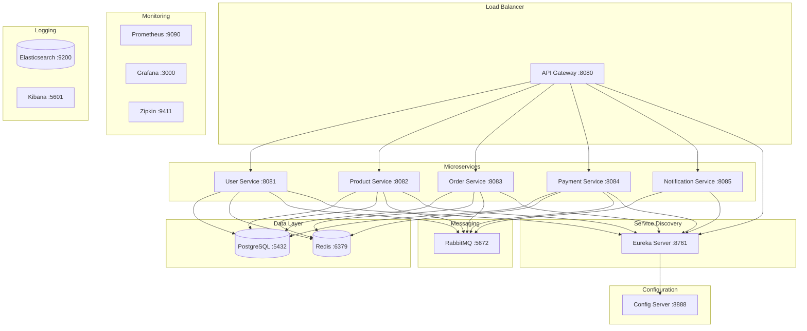

# 🏗️ Compraê Infrastructure

Repositório responsável por orquestrar e executar todos os serviços do ecossistema Compraê juntos usando Docker Compose.

## 📋 Índice

- [Visão Geral](#-visão-geral)
- [Arquitetura](#-arquitetura)
- [Pré-requisitos](#-pré-requisitos)
- [Instalação](#-instalação)
- [Uso](#-uso)
- [Serviços](#-serviços)
- [Monitoramento](#-monitoramento)
- [Desenvolvimento](#-desenvolvimento)
- [Troubleshooting](#-troubleshooting)
- [Contribuição](#-contribuição)

## 🎯 Visão Geral

O **comprae-infra** é o ponto central de orquestração do ecossistema Compraê, fornecendo:

- 🐳 **Docker Compose** para orquestração de serviços
- 📊 **Monitoramento completo** com Prometheus e Grafana
- 🔍 **Logging centralizado** com ELK Stack
- 🚀 **Scripts de automação** para gerenciamento
- 🛠️ **Ambientes separados** para desenvolvimento e produção

## 🏛️ Arquitetura



## 📦 Pré-requisitos

- **Docker** 24.0+ 
- **Docker Compose** 2.20+
- **Git** 2.40+
- **PowerShell** 5.1+ (Windows) ou **Bash** 4.0+ (Linux/Mac)

### Verificação dos Pré-requisitos

```powershell
# Verificar Docker
docker --version

# Verificar Docker Compose
docker-compose --version

# Verificar Git
git --version

# Verificar PowerShell
$PSVersionTable.PSVersion
```

## 🚀 Instalação

### 1. Clone o Repositório

```bash
git clone https://github.com/JonatasSilvaDev/comprae-infra.git
cd comprae-infra
```

### 2. Configure as Variáveis de Ambiente

```bash
cp .env.example .env
# Edite o arquivo .env conforme necessário
```

### 3. Construa as Imagens (Opcional)

```powershell
# PowerShell
.\scripts\manage.ps1 build

# Ou usando Batch
.\scripts\manage.bat build

# Ou usando Make (se disponível)
make build
```

## 🎮 Uso

### Scripts de Gerenciamento

#### PowerShell (Recomendado)

```powershell
# Mostrar ajuda
.\scripts\manage.ps1 help

# Iniciar todos os serviços
.\scripts\manage.ps1 start

# Iniciar ambiente de desenvolvimento
.\scripts\manage.ps1 dev

# Verificar logs
.\scripts\manage.ps1 logs

# Verificar status
.\scripts\manage.ps1 status

# Parar serviços
.\scripts\manage.ps1 stop
```

#### Batch (Alternativo)

```batch
# Mostrar ajuda
.\scripts\manage.bat help

# Iniciar todos os serviços
.\scripts\manage.bat start

# Iniciar ambiente de desenvolvimento
.\scripts\manage.bat dev
```

#### Make (Linux/Mac)

```bash
# Mostrar ajuda
make help

# Iniciar todos os serviços
make start

# Iniciar ambiente de desenvolvimento
make dev

# Verificar logs
make logs
```

### Docker Compose Direto

```bash
# Produção
docker-compose up -d

# Desenvolvimento
docker-compose -f docker-compose.dev.yml up -d

# Parar
docker-compose down
```

## 🔧 Serviços

### Infraestrutura Base

| Serviço | Porta | Descrição | Interface Web |
|---------|--------|-----------|---------------|
| PostgreSQL | 5432 | Banco de dados principal | - |
| Redis | 6379 | Cache e sessões | - |
| Apache Kafka | 9092 | Message broker | - |
| Kafka UI | 8090 | Interface do Kafka | http://localhost:8090 |
| Elasticsearch | 9200 | Busca e logging | - |

### Microserviços E-commerce

| Serviço | Porta | Descrição | Health Check |
|---------|--------|-----------|--------------|
| Config Server | 8888 | Configuração centralizada | http://localhost:8888/actuator/health |
| Eureka Server | 8761 | Descoberta de serviços | http://localhost:8761 |
| API Gateway | 8080 | Gateway de entrada | http://localhost:8080/actuator/health |
| Usuário Service | 8081 | Gestão de usuários | http://localhost:8081/actuator/health |
| Produto Service | 8082 | Gestão de produtos | http://localhost:8082/actuator/health |
| Categoria Service | 8083 | Gestão de categorias | http://localhost:8083/actuator/health |
| Estoque Service | 8084 | Controle de estoque | http://localhost:8084/actuator/health |
| Carrinho Service | 8085 | Carrinho de compras | http://localhost:8085/actuator/health |
| Pedido Service | 8086 | Gestão de pedidos | http://localhost:8086/actuator/health |
| Pagamento Service | 8087 | Processamento de pagamentos | http://localhost:8087/actuator/health |
| Entrega Service | 8088 | Gestão de entregas | http://localhost:8088/actuator/health |
| Notificação Service | 8089 | Sistema de notificações | http://localhost:8089/actuator/health |
| Avaliação Service | 8091 | Sistema de avaliações | http://localhost:8091/actuator/health |

### Monitoramento e Observabilidade

| Serviço | Porta | Descrição | Credenciais |
|---------|--------|-----------|-------------|
| Grafana | 3000 | Dashboards e métricas | admin/admin123 |
| Prometheus | 9090 | Coleta de métricas | - |
| Kibana | 5601 | Visualização de logs | - |
| Zipkin | 9411 | Distributed tracing | - |

## 📊 Monitoramento

### Dashboards Disponíveis

- **Sistema Geral**: Visão overview de todos os serviços
- **Microserviços**: Métricas específicas de cada serviço
- **Infraestrutura**: PostgreSQL, Redis, RabbitMQ
- **JVM**: Métricas da JVM dos serviços Spring Boot

### Health Checks

```powershell
# Verificar saúde de todos os serviços
.\scripts\healthcheck.ps1

# Verificar serviço específico
.\scripts\healthcheck.ps1 user-service
```

### Métricas Importantes

- **Latência**: Tempo de resposta das APIs
- **Throughput**: Requisições por segundo
- **Error Rate**: Taxa de erro
- **Disponibilidade**: Uptime dos serviços
- **Recursos**: CPU, Memória, Disco

## 🛠️ Desenvolvimento

### Ambiente de Desenvolvimento

O ambiente de desenvolvimento inclui ferramentas adicionais:

```powershell
# Iniciar ambiente de desenvolvimento
.\scripts\manage.ps1 dev
```

**Serviços Adicionais:**
- **Adminer** (http://localhost:8081): Interface web para PostgreSQL
- **MailHog** (http://localhost:8025): Captura de emails para testes

### Configurações de Desenvolvimento

- Portas diferentes para evitar conflitos
- Volumes separados
- Configurações de debug habilitadas
- Hot reload quando possível

### Debugging

```bash
# Logs de um serviço específico
docker-compose logs -f user-service

# Entrar no container
docker-compose exec user-service bash

# Verificar variáveis de ambiente
docker-compose exec user-service env
```

## 🔍 Troubleshooting

### Problemas Comuns

#### 1. Porta já em uso
```bash
# Verificar portas em uso
netstat -ano | findstr :8080

# Parar todos os containers
docker-compose down
```

#### 2. Volumes com problemas
```bash
# Limpar volumes
docker-compose down -v
docker volume prune

# Recriar containers
docker-compose up -d
```

#### 3. Imagens desatualizadas
```bash
# Atualizar imagens
docker-compose pull
docker-compose up -d
```

#### 4. Memória insuficiente
```bash
# Verificar uso de memória
docker stats

# Limpar recursos não utilizados
docker system prune -a
```

### Logs e Diagnósticos

```powershell
# Verificar logs do sistema
.\scripts\manage.ps1 logs

# Status detalhado
.\scripts\manage.ps1 status

# Health check
.\scripts\healthcheck.ps1
```

### Comandos Úteis

```bash
# Reiniciar serviço específico
docker-compose restart user-service

# Rebuild e restart
docker-compose up -d --build user-service

# Verificar configuração
docker-compose config

# Verificar networks
docker network ls

# Verificar volumes
docker volume ls
```

## 🤝 Contribuição

### Como Contribuir

1. **Fork** o projeto
2. Crie uma **branch** para sua feature (`git checkout -b feature/nova-feature`)
3. **Commit** suas mudanças (`git commit -am 'Adiciona nova feature'`)
4. **Push** para a branch (`git push origin feature/nova-feature`)
5. Abra um **Pull Request**

### Convenções

- Use **commits semânticos** (feat, fix, docs, etc.)
- **Documente** novas configurações
- **Teste** em ambiente local antes do PR
- **Atualize** o README quando necessário

### Estrutura do Projeto

```
comprae-infra/
├── docker-compose.yml          # Orquestração principal
├── docker-compose.dev.yml      # Ambiente de desenvolvimento
├── .env.example                # Exemplo de variáveis de ambiente
├── Makefile                    # Comandos Make para Linux/Mac
├── scripts/                    # Scripts de automação
│   ├── manage.ps1              # Gerenciamento PowerShell
│   ├── manage.bat              # Gerenciamento Batch
│   ├── healthcheck.ps1         # Health check PowerShell
│   ├── healthcheck.sh          # Health check Bash
│   └── init-databases.sh       # Inicialização do banco
├── monitoring/                 # Configurações de monitoramento
│   ├── prometheus.yml          # Configuração Prometheus
│   └── grafana/               # Configurações Grafana
│       ├── datasources/       # Data sources
│       └── dashboards/        # Dashboards
└── README.md                  # Este arquivo
```

## 📝 Licença

Este projeto está licenciado sob a [MIT License](LICENSE).

## 📞 Suporte

- **Documentação**: [Wiki do Projeto](https://github.com/JonatasSilvaDev/comprae-infra/wiki)
- **Issues**: [GitHub Issues](https://github.com/JonatasSilvaDev/comprae-infra/issues)
- **Discussões**: [GitHub Discussions](https://github.com/JonatasSilvaDev/comprae-infra/discussions)

---

<div align="center">
  <p>🚀 <strong>Compraê Infrastructure</strong> - Orquestrando o futuro do e-commerce</p>
  <p>Feito com ❤️ por <a href="https://github.com/JonatasSilvaDev">Jonatas Silva</a></p>
</div>
